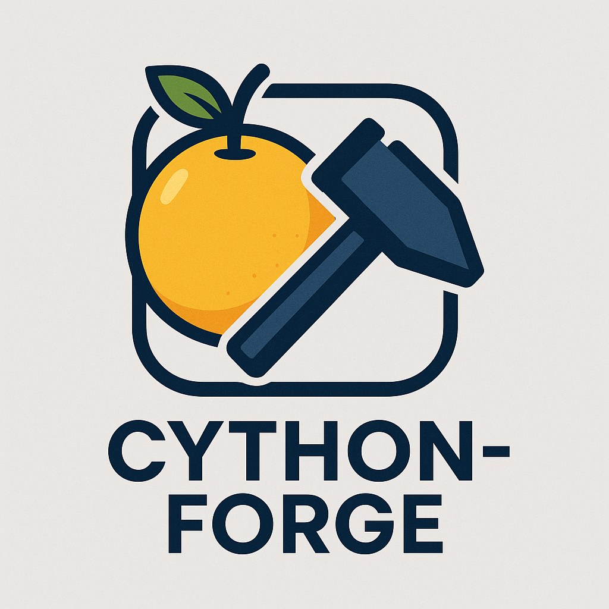

# Cython Forge



[](https://code.visualstudio.com/updates/v1_84)
[](LICENSE)

## Description

Cython Forge is a Visual Studio Code extension that simplifies the build process for Cython files by providing a convenient button to execute `python setup.py build_ext` command.

## Features

- **Build Cython Files**: Build your Cython files with a single click of a button.
- **Select Cython Folder**: Easily select the folder containing your `setup.py` file.
- **Select Virtual Environment**: Choose your Python virtual environment for building.
- **Automatic `setup.py` Detection**: The extension automatically detects if a `setup.py` file exists in the selected folder.
- **Terminal Integration**: The build command is executed in a new terminal, so you can see the output.

## Requirements

- Visual Studio Code version 1.84.0 or above.
- Python and pip for Cython development.

## Installation

To install the `cython-forge-0.0.1.vsix` extension, follow these steps based on your environment:

### For Visual Studio Code (VS Code)

#### From Visual Studio Marketplace:

1.  Open VS Code.
2.  Go to the Extensions view (`Ctrl+Shift+X`).
3.  Search for "Cython Forge".
4.  Click "Install" on the "Cython Forge" extension by `SheikSShajeenAhamed`.
5.  Alternatively, you can install directly from the Marketplace website: [https://marketplace.visualstudio.com/items?itemName=SheikSShajeenAhamed.cython-forge](https://marketplace.visualstudio.com/items?itemName=SheikSShajeenAhamed.cython-forge)

#### Using GUI (Drag & Drop or Command):

1.  Launch VS Code
2.  Go to the Extensions sidebar (`Ctrl+Shift+X`)
3.  Click the 3-dot menu (⋮) on top → select "Install from VSIX..."
4.  Browse and select your file: `cython-forge-0.0.1.vsix`
5.  Wait for installation to complete. Restart VS Code if prompted.

#### Using Command Line:

Make sure you have `code` command available in your terminal.

```bash
code --install-extension cython-forge-0.0.1.vsix
```

⚠️ If `code` is not recognized, open VS Code → `Ctrl+Shift+P` → type `Shell Command: Install 'code' command in PATH` → hit Enter.

Once installed, the extension will appear in your Extensions list.

## Usage

1. Open a project containing Cython files.
2. **Select Cython Folder**: Click the "Select Cython Folder" button in the status bar to choose the subfolder containing your `setup.py` file.
3. **Select Virtual Environment**: Click the "Select Venv" button in the status bar to choose your Python virtual environment.
4. **Build Cython**: Click the "Build Cython" button in the status bar to execute the build command.

## Commands

The following commands are available in the Command Palette (`Ctrl + Shift + P`):

- `Cython Forge: Build Cython`: Build the Cython files.
- `Cython Forge: Select Cython Folder`: Select the folder containing the `setup.py` file.
- `Cython Forge: Select Virtual Environment`: Select the Python virtual environment.

## Development

To set up the development environment:

1. Clone the repository:
   ```bash
   git clone https://github.com/shajeen/cython-forge.git
   cd vscode-cython-builder
   ```
2. Install dependencies:
   ```bash
   npm install
   ```
3. Open the project in VS Code:
   ```bash
   code .
   ```
4. Press `F5` to open a new window with your extension loaded.
5. To package the extension, run the following command:
    ```bash
    npm install -g @vscode/vsce
    vsce package
    ```

## Dependencies

- `python-shell`: Used to execute Python scripts from Node.js.

## Contributing

See [CONTRIBUTING.md](docs/CONTRIBUTING.md) for contribution guidelines.

## License

This project is licensed under the MIT License - see the [LICENSE](LICENSE) file for details.